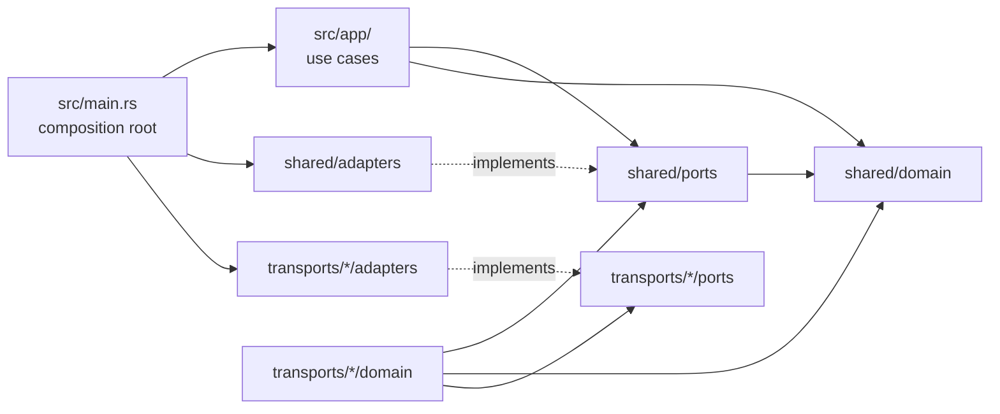

# Code map

Where every file lives and what it owns. For "I want to change feature X, where do I go?", see [`FEATUREMAP.md`](FEATUREMAP.md). For the rules, see [`../AGENTS.md`](../AGENTS.md).

## The shape

- **domain**: the logic. No sockets, files, env, stdio, signals, rustls or str0m.
- **ports**: traits the domain/app call (plus a few small types). No I/O either.
- **adapters**: implement ports with real I/O. Only `main.rs` (and tests) pick them.
- **app**: the use cases (client mode, server mode, relay, shutdown). Ports only.
- A transport depends on `shared`, never on `app` or on another transport. `shared` knows neither `app` nor any transport.

`tests/architecture.rs` checks these rules on the source text (`#[cfg(test)]` tails are exempt). It finds transports by listing `src/transports/`, so a new transport is checked without editing it.

## Request flow

**Client** (tor → lyrebird → bridge):
`main.rs` → `app::run` (`app/mod.rs`) → `managed::is_client` → `app/client.rs::setup` (one SOCKS listener per `TOR_PT_CLIENT_TRANSPORTS` entry, `CMETHOD` lines) → per connection `handle`: `SocksServer::handshake` (`shared/adapters/socks5.rs`) → `ClientFactory::parse_args` → `ClientFactory::dial` (transport) → `app/relay.rs::copy_loop`.

**Server** (bridge client → lyrebird → tor's ORPort), obfs4 only:
`app::run` → `app/server.rs::setup` (one listener per bindaddr, `SMETHOD` lines with `cert=`/`iat-mode=`) → per connection: `ServerFactory::wrap` (obfs4 server handshake) → `OrConnector::connect` (`shared/adapters/extorport.rs`) → `copy_loop`.

**Shutdown**: `shared/adapters/signals.rs` (SIGINT/SIGTERM, stdin close, parent death) → `SignalSource` port → `app/termmon.rs::TermMonitor`.

## `src/` file by file

### Root

| File | Owns |
|---|---|
| `main.rs` | Composition root: parses flags, builds the tokio runtime, picks every adapter, builds the transport `Registry`, calls `app::run`. **Registering a transport happens here.** |
| `lib.rs` | Module tree, crate docs, `VERSION`. |

### `app/`: use cases (upstream `cmd/lyrebird`)

| File | Owns |
|---|---|
| `mod.rs` | `Ports` (every outside dependency), `Settings`, `run`: managed-mode check, state dir, log file, client/server dispatch, wait for shutdown. |
| `client.rs` | Client mode: `CMETHOD` registration, outbound proxy selection, SOCKS accept loop, per-connection dial and SOCKS reply codes. |
| `server.rs` | Server mode: `SMETHOD` registration, bind address rules (`0.0.0.0` → all), accept loop, ORPort handoff. |
| `relay.rs` | `copy_loop`: both directions until both end, then shutdown with 1 s timeout. |
| `registry.rs` | `Registry`: transports by method name. |
| `termmon.rs` | `TermMonitor`: signals + live-handler count → when to exit. |

### `shared/domain/`: pure logic every part uses

| File | Owns | Upstream |
|---|---|---|
| `pt/args.rs` | `Args`, client-parameter and `TOR_PT_SERVER_TRANSPORT_OPTIONS` parsing, `SMETHOD ARGS:` encoding | goptlib `args.go` |
| `pt/control.rs` | `TorControl`: all control lines (`VERSION`, `CMETHOD`, `SMETHOD`, `PROXY`, `STATUS`, `LOG`, `*-ERROR`), `PtError`, `TorControl::capture()` for tests | goptlib `pt.go` |
| `pt/managed.rs` | `TOR_PT_*` environment: version negotiation, `is_client`, `client_setup`/`ClientInfo`, `server_setup`/`ServerInfo`/`Bindaddr`, state dir | goptlib `pt.go` |
| `pt/addr.rs` | `split_host_port`, `resolve_addr` with Go's rules | goptlib, Go `net` |
| `proxy.rs` | `TOR_PT_PROXY`: URI parsing, lyrebird's validation, `ProxyConfig` | `cmd/lyrebird/pt_extras.go` |
| `http.rs` | HTTP/1.1 request encoding and response parsing the way Go writes/reads it (`Connection`, `ResponseHead`) | Go `net/http` subset |
| `scrub.rs` | Address scrubber (`[scrubbed]`) | `common/log`, ptutil safelog |
| `crypto/csrand.rs` | OS randomness with Go `math/rand` helpers | `common/csrand` |
| `crypto/drbg.rs` | SipHash-2-4 OFB DRBG (`HashDrbg`, `Seed`) | `common/drbg` |
| `crypto/gorand.rs` | Go `math/rand` v1 over any source (bit-exact) | Go `math/rand` |
| `crypto/probdist.rs` | `WeightedDist` (length/IAT tables, bit-exact with amd64 Go) | `common/probdist` |
| `crypto/ntor.rs` | obfs4's ntor variant, `Keypair`, `NodeId`, `PublicKey`, KDF | `common/ntor` |
| `crypto/x25519ell2.rs` | Elligator2 with the "dirty" key fix | `internal/x25519ell2` (GPL) |
| `crypto/field.rs` | GF(2^255-19) on fiat-crypto | filippo.io/edwards25519/field |
| `crypto/replayfilter.rs` | Time-bounded replay filter | `common/replayfilter` |

### `shared/ports/`: interfaces to the outside world

| File | Trait / item | Implemented by |
|---|---|---|
| `transport.rs` | `Transport`, `ClientFactory`, `ServerFactory`, `Conn` (`ReadHalf` + `WriteHalf`), `DialError`, `Plain` | each `transports/*/domain/transport.rs` |
| `stream.rs` | `ByteStream`, `BoxStream`, `BoxFuture`, `BoxError`, `split_locked` | TCP, TLS, duplex pipes |
| `dialer.rs` | `Dialer` (`dial`, `is_direct`) | `adapters/tcp.rs::DirectDialer`, `adapters/proxy.rs::ProxyDialer` |
| `net.rs` | `Network` (listen + dialer choice), `Listener` | `adapters/tcp.rs::TcpNetwork` |
| `socks.rs` | `SocksServer`, `SocksRequest`, `ReplyCode`, `error_to_reply_code` | `adapters/socks5.rs` |
| `orport.rs` | `OrConnector` | `adapters/extorport.rs` |
| `env.rs` | `Env` | `adapters/process_env.rs` |
| `control.rs` | `ControlOutput` (one line to tor) | `adapters/stdout.rs` |
| `storage.rs` | `Storage` (private dir, log file) | `adapters/fs.rs` |
| `signals.rs` | `SignalSource`, `Signal` | `adapters/signals.rs` |
| `log.rs` | `LogSink` + the logging policy itself: levels, `notice/error/warn/info/debug/print`, `elide_addr`, `elide_error`, `scrubbed` | `adapters/fs.rs` (file sink) |

### `shared/adapters/`: real I/O

| File | Owns | Upstream |
|---|---|---|
| `cli.rs` | Flags in Go `flag` syntax, `USAGE` | `cmd/lyrebird` flags |
| `tcp.rs` | `DirectDialer`, `TcpNetwork`, listener (IPv6 wildcard fallback) | `cmd/lyrebird` |
| `proxy.rs` | `ProxyDialer`: http CONNECT, socks4a, socks5 client | `cmd/lyrebird/proxy_*` |
| `socks5.rs` | SOCKS5 server for tor, args in RFC 1929 user/pass | `common/socks5` |
| `extorport.rs` | Extended ORPort client, auth cookie | goptlib |
| `stdout.rs` | Control lines on stdout | goptlib |
| `process_env.rs` | Process environment | — |
| `fs.rs` | State dir creation (0700), `lyrebird.log` sink | `common/log`, goptlib |
| `signals.rs` | SIGINT/SIGTERM, stdin close, parent death (Linux: `rustix`) | `cmd/lyrebird/termmon*` |
| `httpc.rs` | HTTP/1.1 client (plain / rustls, keep-alive, gzip, fronting, proxy dialers) | Go `net/http` subset |

### `transports/obfs4/` (client + server)

| File | Owns |
|---|---|
| `domain/transport.rs` | `Transport` (`TRANSPORT_NAME`, arg names, `IatMode`), server factory construction, close delay |
| `domain/client.rs` | `ClientFactory`: bridge-line args (`cert` or `node-id`+`public-key`, `iat-mode`), client handshake |
| `domain/server.rs` | `ServerFactory`: server handshake, replay filter, probe-resistant close delay |
| `domain/handshake.rs` | Handshake messages (`ClientHandshake`, `ServerHandshake`), epoch hour, MACs |
| `domain/framing.rs` | Frame `Encoder`/`Decoder` (secretbox, obfuscated length) |
| `domain/packet.rs` | Packets in frames (payload / PRNG seed, padding) |
| `domain/conn.rs` | Established connection: `Obfs4Reader`/`Obfs4Writer`, length and IAT obfuscation, paranoid mode, `SharedDists` |
| `domain/state.rs` | Bridge identity (`ServerState`), `cert=` encoding, bridge line text; test `MemoryStore` |
| `domain/buf.rs` | FIFO byte buffer (private) |
| `ports/state_store.rs` | `BridgeStateStore`, `StoredState` |
| `adapters/fs_state_store.rs` | `obfs4_state.json`, `obfs4_bridgeline.txt` (0600) |

### `transports/snowflake/` (client only)

| File | Owns |
|---|---|
| `domain/transport.rs` | `Transport`, `Ports` (rendezvous, webrtc, nat_probe), `ClientFactory`, timeouts and window sizes |
| `domain/config.rs` | Bridge-line args (`url`, `front`/`fronts`, `ampcache`, `sqsqueue`, `sqscreds`, `ice`, `max`, `fingerprint`, `utls-nosni`, `utls-imitate`, `proxy`), ICE server parsing |
| `domain/broker.rs` | Poll request/response JSON, `BrokerChannel` (picks HTTP/AMP/SQS rendezvous), NAT type sent |
| `domain/client.rs` | `SnowflakeClient`: peer pool, Turbo Tunnel session, the `Conn` handed to tor |
| `domain/peer.rs` | One snowflake: offer → broker → answer, data channel as a pipe, `SnowflakeCarrier` |
| `domain/turbotunnel.rs` | `RedialPacketConn`: packets survive carrier loss, client ID token |
| `domain/encapsulation.rs` | Length-prefixed packets over the data channel |
| `domain/kcp.rs` | KCP ARQ state machine (sans I/O, kcp-go port) |
| `domain/kcp_session.rs` | `KcpSession`: KCP over the packet conn |
| `domain/smux.rs` | smux v1/v2 stream multiplexer |
| `domain/nat.rs` | NAT type policy and refresh |
| `domain/events.rs` | Status events → tor `LOG` lines |
| `ports/rendezvous.rs` | `RendezvousFactory` (http / amp_cache / sqs), `Rendezvous` |
| `ports/webrtc.rs` | `WebRtc`, `PendingOffer`, `ChannelLink` |
| `ports/nat_probe.rs` | `NatProbe` |
| `adapters/rendezvous.rs` | `RendezvousClients`: HTTP (domain fronting), AMP cache, SQS over `httpc` |
| `adapters/amp.rs` | AMP cache path/URL encoding and armor decoding |
| `adapters/sqs.rs` | Minimal SQS client with SigV4 |
| `adapters/webrtc.rs` | `Str0mWebRtc`: candidate gathering, offer, peer task on str0m |
| `adapters/stun.rs` | STUN binding client, `StunNatProbe` |

### `transports/webtunnel/` (client only)

| File | Owns |
|---|---|
| `domain/transport.rs` | `Transport`, `ClientFactory`: dial → TLS → upgrade → tunnel, error reporting to tor |
| `domain/config.rs` | Bridge-line args (`url`, `addr`, `servername`, `sni-imitation`, `utls`, `cert`, `cert-domain`), uTLS name list, `tls_checks` |
| `domain/servername.rs` | SNI rotation `Generator` and per-factory `Holder` |
| `domain/upgrade.rs` | HTTP upgrade request and `101` check |
| `ports/tls.rs` | `TlsConnector`, `TlsHandshake`, `Verify` |
| `adapters/rustls.rs` | `RustlsConnector`: webpki roots, name/pin verifiers, `chain_hash` |

## Tests and tools

| Path | What | Run |
|---|---|---|
| `#[cfg(test)] mod tests` at the end of each file | Unit tests, next to the code | `cargo test --lib` |
| `tests/vectors/*.json` | Byte vectors recorded from lyrebird 0.8.1; read via `include_str!` by `crypto/{drbg,ntor,probdist,x25519ell2}.rs`, `obfs4/domain/{framing,handshake,state}.rs`. Fixed data, do not regenerate. | part of `--lib` |
| `tests/architecture.rs` | Layer rules | `cargo test --test architecture` |
| `tests/interop.rs` | obfs4 through the built binary, client + server, iat-mode 0/1/2 | `cargo test --release --test interop` |
| `tests/webtunnel.rs` | webtunnel through the binary against an in-process upgrade server | `cargo test --test webtunnel` |
| `tools/arti-e2e/` | Arti bootstraps through real Tor bridges in Docker (`run.sh [obfs4\|snowflake\|webtunnel]`, `bridges.sh` fetches bridge lines, gitignored) | needs Docker + network |
| `Dockerfile` | Release image with `/usr/local/bin/lyrebird` | `docker build -t lyrebird-rs .` |
